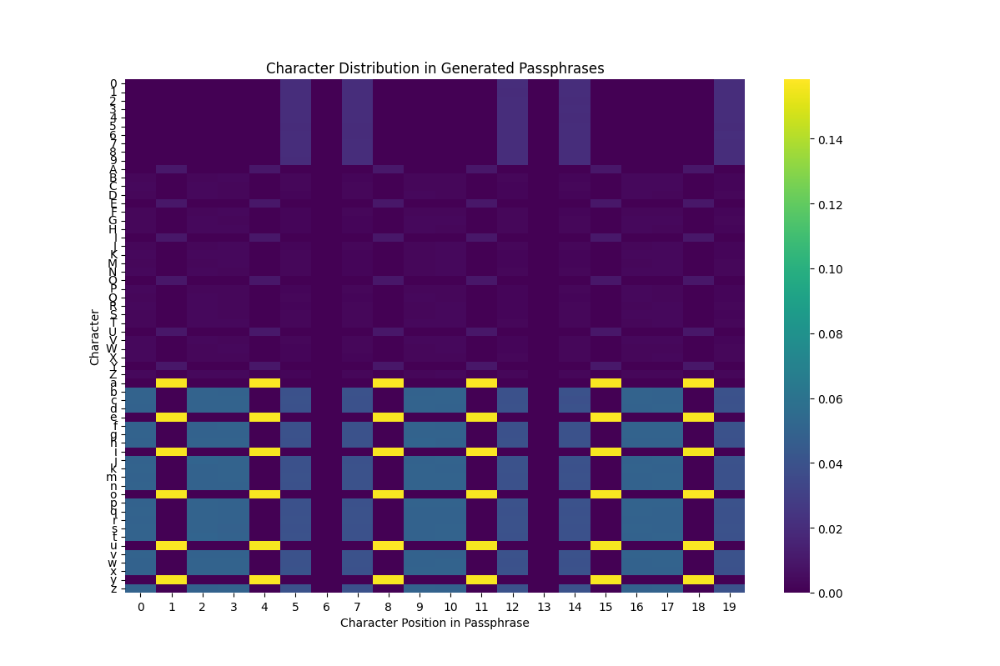

# apwgen

A phoneme-based passphrase generator inspired by the [Apple Passwords app](https://rmondello.com/2024/10/07/apple-passwords-generated-strong-password-format/).

Apwgen is a command-line tool designed to generate secure, yet memorable, passphrases. It uses a syllable-based approach to create pronounceable words, making it easier to remember compared to fully random passwords.

The program leverages the [secrets](https://docs.python.org/3/library/secrets.html) library, ensuring cryptographically secure randomness. It requires Python 3.6 or later.

## Installation

Clone the repository and install with:
```bash
pip install .
```

## Usage

Apwgen is used via the command line, with several configurable arguments to customize the passphrase generation process.


```
usage: apwgen.py [-h] [--version] [-w WORDS] [-s SYLLABLES] [-c COUNT]
                 [-u UPPER] [-n NUM_DIGITS] [-a] [-d DELIMITERS]
                 [--vowels VOWELS] [--consonants CONSONANTS]
                 [--numerics NUMERICS]

options:
  -h, --help            show this help message and exit
  --version             Show version and author information.
  -w, --words WORDS     Specify the number of words to add.
  -s, --syllables SYLLABLES
                        Specify the number of syllables a single word should
                        contain.
  -c, --count COUNT     Number of passphrases to generate. One per line.
  -u, --upper UPPER     Number of upper case characters to include.
  -n, --numdigits NUM_DIGITS
                        Number of digits to include in passphrase.
  -a, --allnums         Allow digits to be placed on a any position. Otherwise
                        they will be allowed only before or after a delimiter
                        and on the last position.
  -d, --delimiters DELIMITERS
                        Delimiter(s) to put between words. Default: '-'
  --vowels VOWELS       List of vowels to choose from. Default: 'aeiouy'
  --consonants CONSONANTS
                        List of consonants to choose from. Default:
                        'bcdfghjkmnpqrstvwxz'
  --numerics NUMERICS   List of numerics to choose from. Default: '0123456789'
```

Basic Usage

```
$ ./apwgen.py
ryrhUx-cuqgiq-8yqcet
```

Customizing Syllables and Words

```
$ ./apwgen.py -s3
wonpebcy4-baptyjvaq-dymwaVmet

$ ./apwgen.py -s3 -w2
norsihpuw-tUtguwdu4
```

Custom Delimiters and Multiple Passphrases

```
$ ./apwgen.py -w4 -d ':-/' -c5
pazket/Dircax:3ojwiz/zactyh
micvot-detti2:gyfsax:Cizfej
rymxot:vutbar-kitvum/6opriK
hyrpuv/fyxkyb-9awkyf:tuQwif
jonvi3/nenwoh-vawpac-rUwbov
```

## Password Format

Passphrases consist of multiple words separated by delimiters. Each word is formed from a fixed number of syllables. A syllable is constructed using a consonant-vowel-consonant (CVC) pattern.

Default Structure

    Words: 3
    Syllables per word: 2
    Default Delimiter: -
    Additional Modifications:
        1 digit replaces a random character.
        1 random character is capitalized.

Example Format

```
cvccvx-xvccvx-xvccvx

v: vowel (aeiouy)
c: consonant (bcdfghjkmnpqrstvwxz)
x: consonant, vowel, or digit
```

Example Output

```wurmos-8ajkim-citFox```

## Correctness

The scripts/colorplot.py script generates a heatmap to visualize character distribution in generated passphrases. This helps analyze randomness and placement of numbers and upper case characters.




## References

 - [Python 3 Library: secrets](https://docs.python.org/3/library/secrets.html)
Cryptographic random number generator for Python.
 - [Python 3 library: argparse](https://docs.python.org/3/library/argparse.html)
Library for handling command-line arguments.
 - [European Union Public License 1.2](https://joinup.ec.europa.eu/collection/eupl/eupl-text-eupl-12)
License under which this project is distributed.
 - [Apple Passwords strong password format](https://rmondello.com/2024/10/07/apple-passwords-generated-strong-password-format/)
Inspiration for the passphrase generation format.
 - [XKCD-password-generator](https://github.com/redacted/XKCD-password-generator/)
Another passphrase generator with similar goals.
