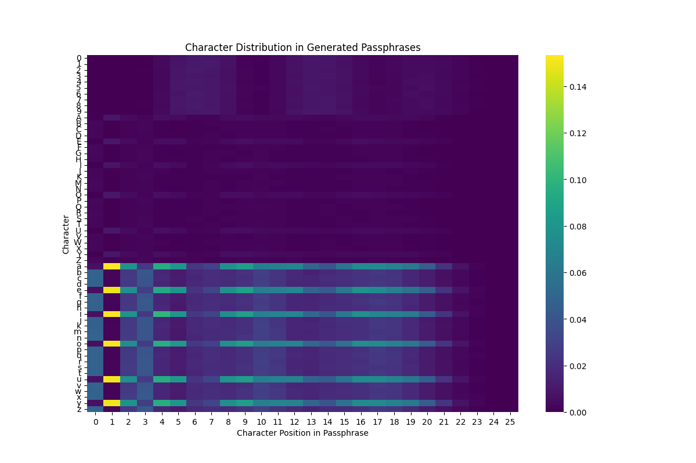
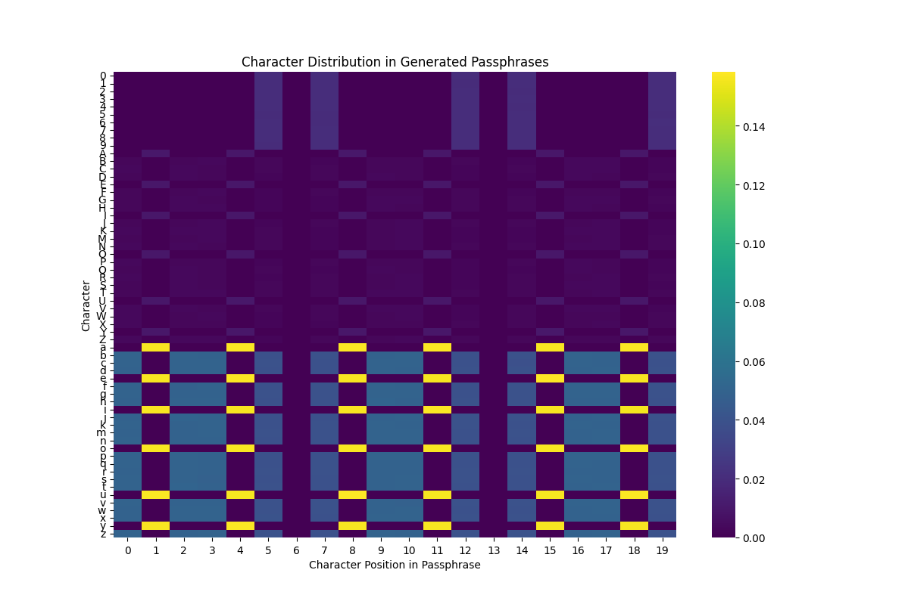

# apwgen

A phoneme-based passphrase generator inspired by the [Apple Passwords app](https://rmondello.com/2024/10/07/apple-passwords-generated-strong-password-format/).

Apwgen is a command-line tool designed to generate secure, yet memorable, passphrases. It uses a syllable-based approach to create pronounceable words, making it easier to remember compared to fully random passwords.

The program leverages the [secrets](https://docs.python.org/3/library/secrets.html) library, ensuring cryptographically secure randomness. It requires Python 3.6 or later.

## Installation

Clone the repository and install with:
```bash
pip install .
```


## Usage

Apwgen is used via the command line, with several configurable arguments to customize the passphrase generation process.

```
usage: apwgen [-h] [--version] [-w WORDS] [-s SYLLABLES] [-c COUNT]
              [-u UPPER] [-n NUM_DIGITS] [-l LENGTH] [-a] [-d DELIMITERS]
              [--vowels VOWELS] [--consonants CONSONANTS]
              [--numerics NUMERICS] [--strict] [-e]

options:
  -h, --help            show this help message and exit
  --version             Show version and author information.
  -w, --words WORDS     Specify the number of words to add.
  -s, --syllables SYLLABLES
                        Specify the number of syllables a single word should
                        contain.
  -c, --count COUNT     Number of passphrases to generate. One per line.
  -u, --upper UPPER     Number of upper case characters to include.
  -n, --numdigits NUM_DIGITS
                        Number of digits to include in passphrase.
  -l, --length LENGTH   Ensure a minimum password length after all modifiers
                        were applied.
  -a, --allnums         Allow digits to be placed on a any position. Otherwise
                        they will be allowed only before or after a delimiter
                        and on the last position.
  -d, --delimiters DELIMITERS
                        Delimiter(s) to put between words. Default: "-"
  --vowels VOWELS       Specifies the vowel pool for syllables. Default:
                        "aeiouy"
  --consonants CONSONANTS
                        Specifies the consonant pool for syllables. Default:
                        "bcdfghjkmnpqrstvwxz"
  --numerics NUMERICS   Specify the digit pool. Default: "0123456789"
  --strict              Ensure all modifiers (upper case, digits) could be
                        applied.
  -e, --entropy         Show estimated entropy in bits after generating
                        passphrases.
```

Basic Usage

```
$ apwgen
ryrhUx-cuqgiq-8yqcet
```

Customizing Syllables and Words

```
$ apwgen -s3
wonpebcy4-baptyjvaq-dymwaVmet

$ apwgen -s3 -w2
norsihpuw-tUtguwdu4
```

Custom Delimiters and Multiple Passphrases

```
$ apwgen -w4 -d ":-/" -c5
dunciom/joxSe7:kebpo-zexri
tuugar-9uxreab-kOoqay-niktev
reUih:giydig/4eygvic/ceehxov
caaduyg/baiTnok:jawx7/cabmo
foyGee3-cuunpyih/jemzum/daqwyys
```


Minimum length

```
$ apwgen -l 24
vurxaFpuo-toapiic-6urqoah
```

Show entropy estimate

```
$ apwgen -e
kibMez-syucyr-5yadiw
Estimated entropy: 86.9 bits

$ apwgen -l 24 -e
vurxaFpuo-toapiic-6urqoah
Estimated entropy: 85.3 bits
```

Single word without upper case characters

This might be useful for generating a randomized prefix/suffix for usernames, mail addresses, etc. Don't use this for passwords!

```
$ apwgen -w1 -u0 -c5 -e
pysj1
jeku0
xoepqu0
qeny5
tautyy4
Estimated entropy: 29.0 bits
```


## Password Format

Passphrases consist of multiple words separated by delimiters. Each word is formed from a configurable number of syllables. Syllables are generated from one of five patterns, selected with a weighted random distribution that favours longer patterns:

| Type | Pattern | Probability |
|------|---------|-------------|
| 0    | CVC     | 36%         |
| 1    | CVVC    | 28%         |
| 2    | CVV     | 20%         |
| 3    | CV      | 12%         |
| 4    | VC      |  4%         |

C=consonant, V=vowel

Because syllable length varies (2–4 characters), word and passphrase length are not fixed. Use `-l` to enforce a minimum length.

Default Structure

    Words: 3
    Syllables per word: 2
    Default Delimiter: -
    Additional Modifications:
        1 digit replaces a random character.
        1 random character is capitalized.

Example Output

```
❯ apwgen -c20
bivguk-muihay-5Euvkoy
iwqiy-kiacjyk-paBny1
quWxaoc-geri4-qiaqag
cuhO2-hucpoiw-qenpy
jiHuo-goomqy0-mymyun
qawbo1-jaskyo-xibuOd
vobaur-togjye4-xiVqei
soapqeur-jarzuc-2afmEg
fybmEj-coxkoy6-qytwou
sizdeeM-paenuus-9edoig
zyJi-hujhie-8owoo
xoadgot-fomfi1-caApdyn
fixzaA-3eufeo-vefav
paimk7-jufayx-Kasmayt
meafi-4Extug-zakye
jaepuo-0osHa-gyiggoa
pyexu-6uvdeM-kaosve
keebboo-deicae7-ryUxmid
gecna7-titUo-jicbyi
rafay-vErye3-xahhyow
```

## Entropy

The `-e` flag prints an estimated entropy in bits after generating passphrases. The estimate accounts for:

- The non-uniform syllable type distribution (weighted random)
- Character pool sizes (vowels, consonants, numerics)
- Digit placement positions
- Uppercase placement positions
- Delimiter pool size
- The rejection-sampling effect of `--length` (passphrases too short are discarded and regenerated, which reduces the effective sample space)

With default settings the estimate is approximately **87 bits**.

## Correctness

The script at scripts/colorplot.py generates a heatmap to visualize character distribution in generated passphrases. This helps analyze randomness and placement of numbers and upper case characters.

For Version 2.0.0:


For Version 1.x:



## References

 - [Python 3 Library: secrets](https://docs.python.org/3/library/secrets.html)
Cryptographic random number generator for Python.
 - [Python 3 library: argparse](https://docs.python.org/3/library/argparse.html)
Library for handling command-line arguments.
 - [European Union Public License 1.2](https://joinup.ec.europa.eu/collection/eupl/eupl-text-eupl-12)
License under which this project is distributed.
 - [Apple Passwords strong password format](https://rmondello.com/2024/10/07/apple-passwords-generated-strong-password-format/)
Inspiration for the passphrase generation format.
 - [XKCD-password-generator](https://github.com/redacted/XKCD-password-generator/)
Another passphrase generator with similar goals.
